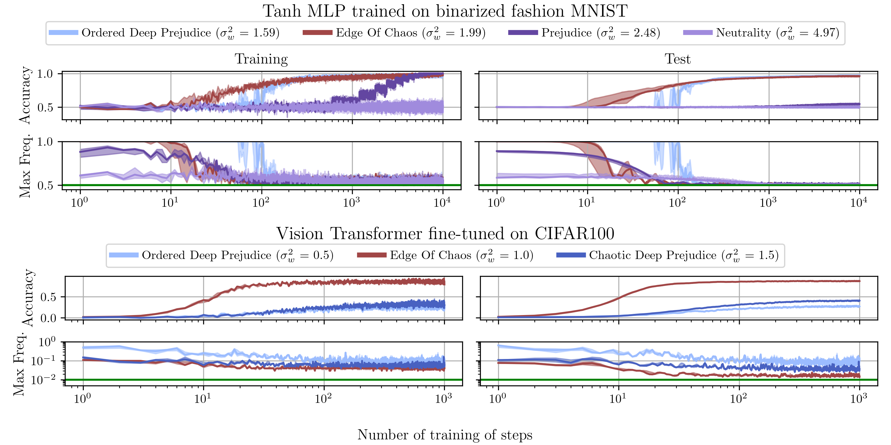

# Initial Guessing Bias and Trainability

### Official implementation for the ICLR 2026 paper

## *When Bias Meets Trainability: Connecting Theories of Initialization*

<p align="center">
  <a href="https://arxiv.org/abs/2505.12096">
    
  </a>
  <a href="https://openreview.net/forum?id=75ce9hnKne">
    
  </a>
</p>

This repository contains the official implementation accompanying the ICLR 2026 publication:

> **When Bias Meets Trainability: Connecting Theories of Initialization**

The work studies the connection between **Initial Guessing Bias (IGB)** and neural-network trainability by combining theoretical analysis and empirical experiments across architectures and initialization regimes.

---

# Paper

- **arXiv:** https://arxiv.org/abs/2505.12096  
- **OpenReview:** https://openreview.net/forum?id=75ce9hnKne  

If you use this repository, please cite the paper (BibTeX below).

---

# Repository structure

```text
igb_and_trainability/
│
├── src/                         # Core implementation
├── plot/                        # Figure generation scripts
│
├── train_spec_mlp_bfmnist/
├── train_spec_mlp_cifar10/
├── train_spec_resmlp_bfmnist/
├── train_spec_vit_bcifar/
├── train_spec_vit_cifar10/
│
├── main_init.py
├── main_forward.py
├── main_dip.py
├── main_train.py
├── compute_eoc.py
├── compute_neutrality.py
│
├── main_train.png
└── README.md
```

---

# Installation

Clone the repository:

```bash
git clone https://github.com/abassi98/igb_and_trainability.git
cd igb_and_trainability
```

Create a Python environment:

```bash
conda create -n igb_trainability python=3.10
conda activate igb_trainability
```

Install dependencies:

```bash
pip install \
torch \
torchvision \
lightning \
pytorch-lightning \
datasets \
mpi4py \
numpy \
scipy \
pandas \
matplotlib \
h5py \
tqdm \
cmcrameri
```

If using MPI execution:

Ubuntu:

```bash
sudo apt install openmpi-bin libopenmpi-dev
```

macOS:

```bash
brew install open-mpi
```

---

# Reproducing the Results

The repository reproduces four classes of experiments.

---

## 1. Initialization and gradient statistics

This reproduces initialization scans and computes quantities related to Initial Guessing Bias.

Single process:

```bash
python main_init.py \
    --model MLP \
    --data bfmnist \
    --max_depth 100 \
    --width 1000 \
    --act_func ReLU \
    --Vw_min 0.1 \
    --Vw_max 2.0 \
    --Vb_min 0.0 \
    --Vb_max 0.2 \
    --n_w 20 \
    --n_b 10
```

Distributed execution:

```bash
mpirun -np 20 python main_init.py \
    --model MLP \
    --data bfmnist \
    --max_depth 100 \
    --width 1000 \
    --act_func ReLU \
    --n_w 20 \
    --n_b 10
```

This stage generates initialization statistics used in subsequent analysis.

---

## 2. Forward dynamics simulations

Forward propagation statistics over random ensembles.

```bash
mpirun -np 20 python main_forward.py \
    --max_depth 100 \
    --width 1000 \
    --act_func ReLU \
    --Vw_min 1.0 \
    --Vw_max 3.0 \
    --Vb_min 0.0 \
    --Vb_max 0.2 \
    --n_w 20 \
    --n_b 1 \
    --n_net_samples 10
```

This generates quantities used to study phase transitions and trainability.

---

## 3. Deep information propagation (DIP)

Reproduce standard mean-field results, in particular from "Deep information propagation" (arXiv:1611.01232) by Schoenholz et al. 

```bash
mpirun -np 20 python main_dip.py \
    --max_depth 100 \
    --act_func ReLU \
    --Vw_min 1.0 \
    --Vw_max 3.0 \
    --Vb_min 0.0 \
    --Vb_max 0.2 \
    --n_w 20 \
    --n_b 1 \
    --n_samples 4
```

---

## 4. Supervised training experiments

Training runs are controlled via configuration files.

Example:

```bash
python main_train.py train \
    --seed 0 \
    --spec_file train_spec_mlp_bfmnist/mlp_relu_bfmnist_run1.cfg
```

Other experiment suites:

```text
train_spec_mlp_bfmnist/
train_spec_mlp_cifar10/
train_spec_resmlp_bfmnist/
train_spec_vit_bcifar/
train_spec_vit_cifar10/
```

Training logs are stored automatically.

---

# Reproducing Figures

All figure generation scripts are located under:

```text
plot/
```

Example commands:

```bash
python plot/plot_init.py
python plot/plot_forward.py
python plot/plot_dip.py
python plot/plot_phase_diagram.py
python plot/plot_train_main.py
```

Plots are saved locally by the scripts.

---

# Main Figures

## Figure 3 (Main paper)

Place the exported Figure 3 into:

```text
assets/fig3.png
```

Then include:

```html
<p align="center">
  
</p>
```

---

## Main training figure

<p align="center">
  
</p>

---

# Citation

If you use this repository, please cite:

```bibtex
@inproceedings{
bassi2026when,
title={When Bias Meets Trainability: Connecting Theories of Initialization},
author={Alberto Bassi and Marco Baity-Jesi and Aurelien Lucchi and Carlo Albert and Emanuele Francazi},
booktitle={The Fourteenth International Conference on Learning Representations},
year={2026},
url={https://openreview.net/forum?id=75ce9hnKne}
}
```
